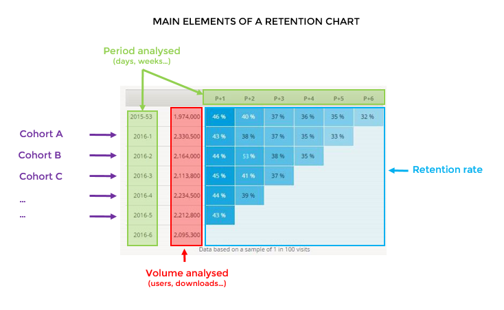

# Automated Cohort Analysis for Venture Capitalists and Startups - CS50 Harvard Final Project
#### Video demo: URL

# Description

#### Obs: CS50 Final Project
Repo for the Final Project of CS50 Course at Harvard

## Introduction
The Final Project consists of an automated Cohort Analysis, a common process made by Venture Capital Analysts when evaluating startups for investment. More specifically, this application focus on retention analysis, the capacity of the company to maitain a customer paying through time or a broker selling in its platform through time, or whatever applly to the company's context.

## Tech Stack (languages and specific libraries/frameworks)
* Flask - for server
* HTML, CSS (Bootstrap), JavaScript - for FrontEnd
* Python - for backend
* Langchain - for LLM analysis
* OpenAI models - for LLM analysis

## Application Structure
The application structure is as presented in the tree below:

cs50_finalproject/
├── README.md
├── app.py
├── processing.py
├── static/
│    ├── vc_img_1.png # A Robot/Venture Capitalist for index.html style
│    ├── retention-graph-example.png # An example of retention matrix for this README.md
│    └── retention_heatmap.png # The resul figure of a processed spreadsheet
├── templates/
│    ├── index.html # Homepage
│    └── results.html # Display the results (Figure + LLM Analysis)
└── uploads/
     ├── file1.csv # Example of file processed
     └── file2.csv # Example of file processed

`processing.py` contains the script that processes the spreadsheet given by the user. It receives the spreadsheet and returns both the figure (Plotted Retention Matrix) and a LLM analysis of the retention matrix. The function process_csv() calls all functions defined in processing.py to make this possible. `app.py` imports the function process_csv() from `processing.py` to use it in a route of the Flask App.

## Functions in `processing.py`

#### load_data()
This function receives a file, identifies the file extension (.csv, .xls, .xslm...) and transforms it properly to a Pandas Dataframe for further processing. If the file extension is not recognized (ex. User submitted a .png instead of a common spreadsheet) the function raises an error and the program stops.

#### format_data()
The raw spreadsheet for a cohort analysis is normally formatted in two columns, one being the date of an interaction (ex. customer buying, clicking, broker selling) and a second one with a unique ID. The function format_data() receives the Pandas Dataframe from load_data(), identifies which column is which, create new columns for cohorts identification and for period_time (date of that event - cohort date, so we can identify where to place that data in the retention matrix). Finally, it calculates cohort sizes, and pivot the columns so they look like a retention matrix (example below)

Source: https://blog.atinternet.com/en/app-analytics-how-to-read-a-retention-graph/

#### plot_graphs()
This function receives the retention matrix formatted from format_data() and plot a beautiful graph from its data. It also anotates into the graph the cohort sizes and save the .png into the /static folder. This last step is useful because we will acess it later to display the graph to the user.

#### llm_analysis()
This function receives the retention matrix from format_data() and a prompt. An LLM instance is created using Langchain library, so we can send prompts and get back responses from OpenAI models. The model here is instructed to conduct a cohort analysis using the retention matrix, so it can help a venture capitalist or entrepreneur.

#### process_csv()
Besides the name, it processes any file extension allowed, as per the way load_data() is structured. This receives as input the spreadsheet and returns both the figure and the llm response. 

## Flask App (`app.py`)
The Flask App has simply two routes: "/" and "/upload". The first one simply renders to the user the index.html template, a homepage with an input for the file to be processed. The second one is where the user is detined after clicking in the Upload button in index.html. If file processing goes as planned (including the whole process of process_csv() described in the last section), the route renders the results.html template to the user, this templates receives the llm_response and is also able to access the .png of the graph in the /static folder. All files processed are stored in the /uploads folder.

#### Obs:
* The whole code is commented to facilitate understanding
* There are lots of "print()" through the code so you can visualize what is happening while the Flask Server is running. This will help you understand what each function is receiving and passing to the other (That really helps debugging)
* requirements are listed in requirements.txt. A virtual environment was created for this project and `pip freeze > requirements.txt` used to list all the dependencies installed in this environment.

